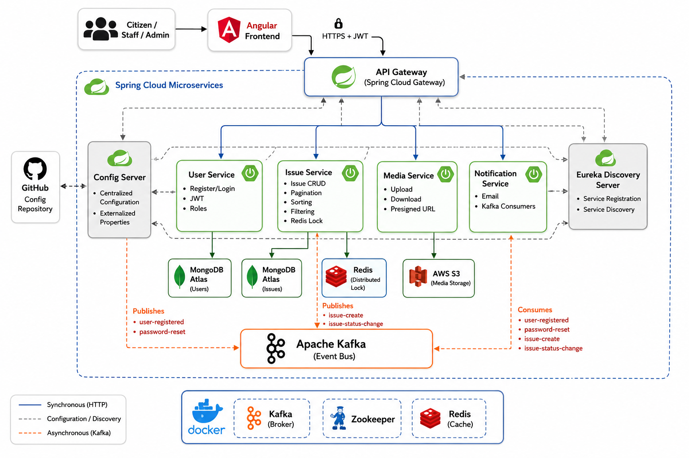

# City Manager – Microservices Backend System

City Manager is a backend system for managing and tracking city-level issues
reported by citizens and handled by staff members. Users register with default
**CITIZEN** access, while a pre-bootstrapped **ADMIN** manages role elevation to
**STAFF**. The system supports **pagination, sorting, and filtering** for efficient
data access across large datasets.

> This project is designed for local execution to demonstrate system design,
> service interaction, and production-like behavior. Cloud deployment and CI/CD
> are intentionally out of scope.

---

## 📚 Table of Contents

- [Functional Overview](#-functional-overview)
- [Architecture Overview](#️-architecture-overview)
- [Tech Stack](#️-tech-stack)
- [Microservices Overview](#️-microservices-overview)
- [Security (JWT)](#-security-jwt)
- [Event-Driven Communication (Kafka)](#-event-driven-communication-kafka)
- [Distributed Locking (Redis)](#-distributed-locking-redis)
- [Media Storage (AWS S3)](#️-media-storage-aws-s3)
- [API Documentation (Swagger)](#-api-documentation-swagger)
- [Centralized Configuration](#️-centralized-configuration)
- [Running the Project Locally](#️-running-the-project-locally)
- [Testing & Code Quality](#-testing--code-quality)
- [What This Project Demonstrates](#-what-this-project-demonstrates)


## 📌 Functional Overview

- Users register with default **CITIZEN** access
- A bootstrapped **ADMIN** manages role assignments
- Citizens can report city-related issues with media attachments
- Staff members review, take ownership, and resolve reported issues
- APIs support **pagination, sorting, and filtering** for scalable data retrieval
- Notifications are sent asynchronously for key actions

---

## 🏗️ Architecture Overview

The system follows a **distributed microservices architecture** with:

- API Gateway for centralized request routing
- Eureka Service Discovery for dynamic service registration
- Centralized Configuration Server (Spring Cloud Config)
- JWT-based authentication with role-based authorization
- Apache Kafka for asynchronous, event-driven workflows
- Redis for distributed locking and concurrency control
- Swagger / OpenAPI for API documentation
- Dockerized local infrastructure (Kafka, Zookeeper, Redis)
- Domain-driven microservices with clear separation of concerns

### System Architecture

> **Note:** All Spring Boot services run locally. Kafka, Redis, and Zookeeper are containerized using Docker. MongoDB Atlas and AWS S3 are external managed services used for persistence and media storage.

<p align="center">
  
</p>

---

## 🛠️ Tech Stack

### Backend
- Java
- Spring Boot
- Spring Cloud (Config Server, Eureka, API Gateway)
- Spring Security + JWT
- Apache Kafka
- Redis (locking & concurrency control)
- MongoDB Atlas
- Swagger / OpenAPI
- Maven (multi-module project)

### Frontend
- Angular

### Infrastructure & Tooling
- Docker
- Kafka + Zookeeper (local)
- Redis (local)
- AWS S3 (media storage)
- Git & GitHub

---

## Microservices Overview

This project is structured as a set of modular microservices.  
Each service has its own README with detailed endpoints, roles, and usage.

| Service | Description | README |
|---------|------------|--------|
| `user-service` | Handles user registration, login, and authentication | [View README](user-service/Readme.md) |
| `issue-service` | Manages issue creation, assignment, and status updates | [View README](issue-service/Readme.md) |
| `media-service` | Handles media upload, download, and S3 presigned URL access | [View README](media-service/Readme.md) |
| `notification-service` | Sends email and system notifications based on events | [View README](notification-service/Readme.md) |
| `api-gateway` | Routes requests to appropriate microservices | [View README](api-gateway/Readme.md) |

---

## 🔐 Security (JWT)

- Stateless authentication using **JWT**
- Role-based access control (**CITIZEN**, **STAFF**, **ADMIN**)
- Access and refresh token mechanism
- Token validation enforced at Gateway and service levels

---

## 🔄 Event-Driven Communication (Kafka)

- Kafka is used for **asynchronous workflows** across services
- Domain events are published on key actions (e.g., issue creation)
- Notification workflows are handled via Kafka consumers
- Shared event schemas are defined in the `event-contracts` module
- Enables loose coupling and scalable communication

---

## 🚀 Distributed Locking (Redis)

- Redis is used to implement **distributed locking**
- Prevents race conditions when multiple users act on the same issue
- Ensures data consistency under concurrent access

---

## ☁️ Media Storage (AWS S3)

- Media files are stored in **AWS S3**
- Backend services handle secure upload and retrieval
- Keeps large binary data out of core databases

---

## 📘 API Documentation (Swagger)

- Swagger / OpenAPI is enabled for all microservices
- Provides interactive API exploration and testing

---

## ⚙️ Centralized Configuration

Service configurations are externalized using Spring Cloud Config.

**Config Repository:**  
https://github.com/SuryaprakashSingh25/cpims-config-repo

**Benefits:**
- Environment-specific configuration
- Clean separation of configuration from code
- Simplified configuration updates

---

## ▶️ Running the Project Locally

### 1️⃣ Clone the Repository

```bash
git clone https://github.com/SuryaprakashSingh25/city-manager.git
```
```bash
cd city-manager

```
### 2️⃣ Start Infrastructure Services

 - Zookeeper

 - Kafka

 - Redis

(Docker-based local setup)

### 3️⃣ Build All Services

```bash
./mvnw clean install
```
 - For front
```bash
cd user-frontend
```
```bash
npm i
```

### 4️⃣ Start Services (Order)

1. Config Server
2. Discovery Server
3. API Gateway
4. Domain Microservices

---

## 🧪 Testing & Code Quality

- Unit tests written for core services
- APIs documented and validated using Swagger
- Emphasis on clean, testable, maintainable code
- Designed APIs with pagination, sorting, and filtering to handle high-volume datasets efficiently


---

## 🎯 What This Project Demonstrates

- Microservices system design
- Secure JWT-based authentication and role based authorization
- Event-driven architecture using Kafka
- Redis-based locking
- Dockerized local environments for zookeeper, kafka, redis
- Cloud storage integration (AWS S3)
- Multi-module Maven project management
- Backend + frontend integration


